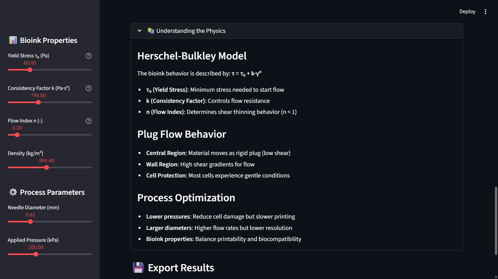

# 🧬 Bioprinting CFD Analysis Tool

[](https://www.python.org/)
[](https://streamlit.io/)
[](LICENSE)
[](https://doi.org/10.1088/1758-5090/ab7553)

> **Interactive CFD analysis tool for extrusion-based bioprinting using the Herschel-Bulkley fluid model**

Optimize bioprinting processes for **cell viability** and **print quality** through real-time flow analysis.

---

## 📸 Application Screenshots

### Main Dashboard
<div align="center">
  
  <p><em>Interactive dashboard with real-time analysis, bioink properties, and cell viability assessment</em></p>
</div>

**Features:**
- 🎚️ **Adjustable Parameters** - Bioink properties and process settings in sidebar
- 📊 **Key Metrics** - Mass flow rate, velocity, shear stress, residence time
- 🧪 **Cell Viability** - Color-coded warnings (Low stress ✅ | Long exposure ❌)
- 📈 **Real-time Updates** - Instant calculations as you adjust sliders

---

### Flow Profiles
<div align="center">
  
  <p><em>Four interactive plots showing velocity, shear rate, shear stress, and viscosity distributions</em></p>
</div>

**Visualizations:**
- 🔵 **Velocity Profile** - Plug flow in center, steep gradient at wall
- 🟢 **Shear Rate Profile** - Zero in plug region, maximum at wall
- 🔴 **Shear Stress Profile** - Yield stress contribution visible
- 🟣 **Viscosity Profile** - Shear-thinning effect (log scale)

---

### Process Design Nomograms
<div align="center">
  
  <p><em>Optimization nomograms mapping flow rate and shear stress across diameter-pressure space</em></p>
</div>

**Optimization:**
- 📊 **Mass Flow Rate Nomogram** - Find conditions for target printing speed
- 🎯 **Shear Stress Nomogram** - Identify safe regions for cells
- 🔄 **Custom Generation** - Create nomograms for your bioink
- 💡 **Visual Decision-Making** - Balance speed vs safety

---

### Educational Content
<div align="center">
  
  <p><em>Built-in explanations of the Herschel-Bulkley model and optimization strategies</em></p>
</div>

**Learning:**
- 📚 **Herschel-Bulkley Model** - τ = τ₀ + k·γⁿ
- 🔬 **Plug Flow Behavior** - Cell protection mechanism
- ⚙️ **Process Optimization** - Trade-offs explained
- 💾 **Export Results** - Download data and reports

---

## 🎯 What This Tool Does

Analyzes fluid flow of bioinks through printing needles to optimize:

✅ **Cell Viability** - Minimize mechanical damage  
✅ **Print Quality** - Optimize flow parameters  
✅ **Process Efficiency** - Maximize printing speed  
✅ **Parameter Selection** - Visual decision-making  

### The Challenge

| Approach | Advantage | Disadvantage |
|----------|-----------|--------------|
| High Pressure | ✅ Faster printing | ❌ Higher cell stress |
| Small Needles | ✅ Better resolution | ❌ More shear forces |
| **This Tool** | ✅ Find optimal balance | ✅ Predict outcomes |

---

## ✨ Key Features

- 🧬 **Herschel-Bulkley Model** - Non-Newtonian fluid behavior
- 📊 **Real-time Analysis** - Instant calculations (< 1 second)
- 🎯 **Cell Viability Assessment** - Color-coded risk evaluation
- 📈 **Interactive Plots** - Velocity, shear, stress, viscosity
- 🗺️ **Process Nomograms** - Multi-parameter optimization
- 💾 **Data Export** - CSV and text reports
- 📱 **Mobile Friendly** - Works on any device
- 🎓 **Educational** - Built-in physics explanations

---

## 🚀 Quick Start

### Run Locally

```bash
# Quick setup (Linux/macOS)
git clone https://github.com/AmirHosseinOsooli/bioprinting-cfd-analysis-Spring-2025.git
cd bioprinting-cfd-analysis-Spring-2025
./setup.sh && ./run.sh

# Quick setup (Windows)
setup.bat && run.bat

# Manual
pip install -r requirements.txt
streamlit run app.py
```

---

## 📖 How to Use

### 1. Set Bioink Properties (Sidebar)

| Parameter | Range | Default | Description |
|-----------|-------|---------|-------------|
| **τ₀** | 10-200 Pa | 60 Pa | Yield stress (flow initiation) |
| **k** | 100-2000 Pa·sⁿ | 790 | Consistency (flow resistance) |
| **n** | 0.1-1.0 | 0.2 | Flow index (shear thinning) |
| **ρ** | 800-1200 kg/m³ | 984.4 | Density |

### 2. Choose Process Parameters

| Parameter | Range | Default | Common |
|-----------|-------|---------|--------|
| **Diameter** | 0.1-2.0 mm | 0.61 mm | 0.25, 0.41, 0.61, 0.84 mm |
| **Pressure** | 50-500 kPa | 200 kPa | 100-300 kPa |

### 3. Analyze Results

- **Key Metrics** - Flow rate, velocity, stress, time
- **Viability** - Green (safe), Yellow (caution), Red (risk)
- **Flow Profiles** - 4 interactive plots
- **Nomograms** - Generate for optimization

### 4. Export Data

- CSV profile data
- Text reports
- Use in publications

---

## 🔬 Scientific Background

Based on: **Emmermacher et al. (2020)** - *Biofabrication* 12(2): 025022

### Herschel-Bulkley Model

```
τ = τ₀ + k·γⁿ
```

- **τ₀** = Yield stress (Pa) - stress to start flow
- **k** = Consistency factor (Pa·sⁿ) - flow resistance
- **γ** = Shear rate (s⁻¹) - velocity gradient
- **n** = Flow index - shear thinning (n < 1)

### Analytical Solution

- ✅ Second-order accuracy O(Δx²)
- ✅ Validated vs CFD (ANSYS Fluent)
- ✅ Fast computation (< 1 second)
- ✅ No iterative solvers needed

---

## 📊 Cell Viability Guidelines

### Shear Stress Limits

| Stress | Risk | Cell Types |
|--------|------|-----------|
| < 1000 Pa | 🟢 Safe | All cells |
| 1000-1500 Pa | 🟡 Moderate | MSCs, fibroblasts |
| 1500-2000 Pa | 🟡 Caution | Test specific |
| > 2000 Pa | 🔴 High | Damage likely |

### Residence Time

| Time | Assessment |
|------|-----------|
| < 100 ms | ✅ Excellent |
| 100-200 ms | ✅ Good |
| 200-500 ms | ⚠️ Monitor |
| > 500 ms | ❌ Reduce |

---

## 💡 Example Uses

### Use Case 1: MSC Optimization

**Goal:** Safe parameters for stem cells

**Settings:**
- Bioink: AMA (τ₀=60, k=790, n=0.2)
- Target: τ < 1500 Pa, speed > 5 mm/s

**Result:**
- Diameter: 0.61 mm
- Pressure: 150 kPa
- ✅ Stress: 1400 Pa, Speed: 8 mm/s

### Use Case 2: Bioink Design

**Goal:** Required rheology

**Needs:**
- Speed: 15 mm/s
- Diameter: 0.41 mm
- Cell limit: 2000 Pa

**Result:**
- τ₀ ≤ 25 Pa
- k ≤ 300 Pa·sⁿ
- n ≈ 0.4

---

## 🛠️ Technology

- **Python 3.8+**
- **Streamlit** - Web framework
- **NumPy** - Computations
- **SciPy** - Optimization
- **Plotly** - Visualizations
- **Pandas** - Data handling


## 🤝 Contributing

Ideas welcome!

- 🐛 Report issues
- 💡 Suggest features
- 📖 Improve docs
- 🧪 Add bioink presets

---

## 📖 Citation

```bibtex
@article{emmermacher2020engineering,
  title={Engineering considerations on extrusion-based bioprinting},
  author={Emmermacher, J. and others},
  journal={Biofabrication},
  volume={12},
  pages={025022},
  year={2020},
  doi={10.1088/1758-5090/ab7553}
}
```

---

## 📄 License

MIT License - See [LICENSE](LICENSE)

---

```
## 👤 Author

**AmirHossein Osooli**
- Project: Computational Fluid Dynamics 1 final project
---

## 📞 Support

- 📖 [Documentation](README.md) | [Quick Start](QUICKSTART.md)
- 🐛 [Issues](https://github.com/AmirHosseinOsooli/bioprinting-cfd-analysis-Spring-2025/issues)
- 💬 [Discussions](https://github.com/AmirHosseinOsooli/bioprinting-cfd-analysis-Spring-2025/discussions)

---

<div align="center">

## 🧬 Made for the Bioprinting Community


**Version 1.0** | **2026** | **MIT License**

⭐ Star on GitHub if you find this useful!

</div>
